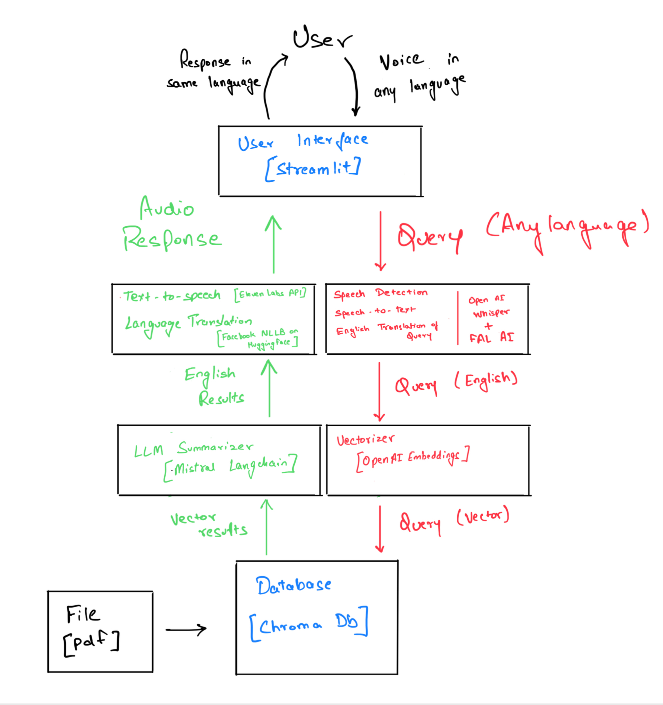

# Doc-Chat: Multi-lingual Conversation with Documents

Doc-Chat is an advanced document interaction system that enables multi-lingual voice conversations with PDF documents. Users can upload any PDF and have natural conversations about its content in their preferred language.

## System Architecture


The system follows a modular architecture with the following key components:

1. **User Interface (Streamlit)**
   - PDF document viewer
   - Voice recording interface
   - Multi-lingual chat interface
   - Audio playback for responses

2. **Natural Language Processing Pipeline**
   - Speech-to-Text conversion using FAL AI's Whisper integration
   - Language detection and translation using NLLB-200
   - RAG (Retrieval Augmented Generation) with Mistral AI
   - Text-to-Speech synthesis using ElevenLabs

3. **Document Processing**
   - PDF parsing and chunking
   - Vector embeddings using OpenAI
   - Vector storage using ChromaDB

## Features
- Upload and view PDF documents
- Voice-based querying in multiple languages
- Automatic language detection
- Context-aware responses using RAG
- Natural voice responses in the user's language
- Persistent chat history
- Real-time audio processing

## Prerequisites
- Python 3.8+
- Required system packages:
  ```
  build-essential
  libasound-dev
  portaudio19-dev
  python3-pyaudio
  ```

## Installation

1. Clone the repository:
```bash
git clone git@github.com:rohan-shnkr/doc-chat.git
cd doc-chat
```

2. Install the required packages:
```bash
pip install -r requirements.txt
```

3. Set up environment variables in a `.env` file:
```
OPENAI_API_KEY=your_openai_key
MISTRAL_AI_API_KEY=your_mistral_key
ELEVENLABS_API_KEY=your_elevenlabs_key
HF_ACCESS_TOKEN=your_huggingface_token
```

## Usage

1. Start the application:
```bash
streamlit run app.py
```

2. Upload a PDF document through the web interface

3. Click "Ask me Anything" and speak your question in any supported language

4. Listen to the response in the same language

## Main Components

### Voice Module
- Handles audio recording and processing
- Manages language detection and translation
- Coordinates the interaction between different components

### RAG Agent
- Processes PDF documents
- Generates embeddings for document chunks
- Retrieves relevant context for queries
- Generates responses using Mistral AI

### Translation Service
- Detects input language
- Translates between source and target languages
- Supports 200+ languages through NLLB

### Text-to-Speech
- Converts text responses to natural speech
- Uses ElevenLabs for high-quality voice synthesis
- Supports multiple voices and languages

## Supported Languages
The system supports 200+ languages for both input and output, including but not limited to:
- English
- Spanish
- French
- German
- Hindi
- Chinese
- Japanese
- Arabic
- And many more...

## Contributing
Contributions are welcome! Please feel free to submit a Pull Request.
